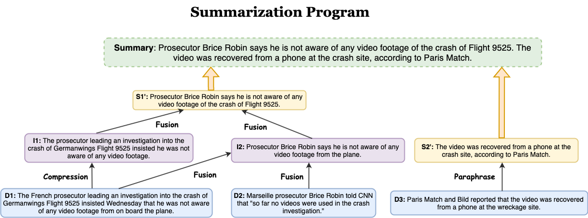
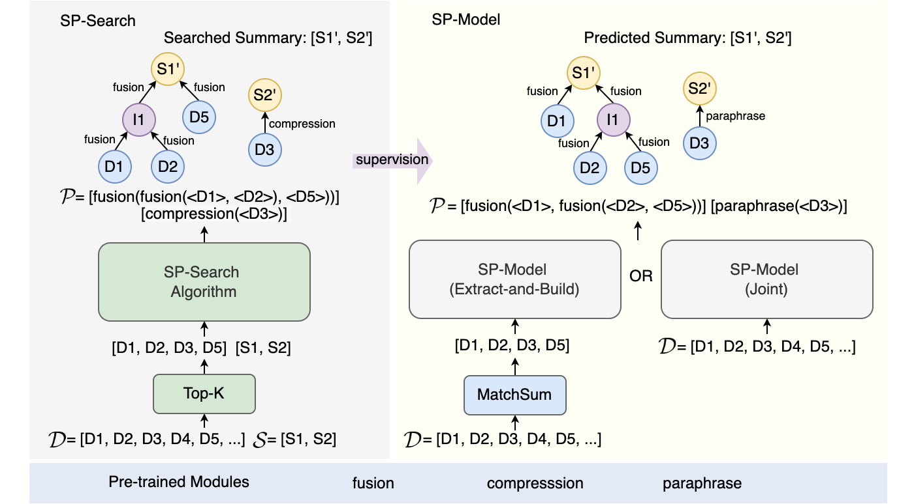

# Summarization Programs

[Summarization Programs: Interpretable Abstractive Summarization with Neural Modular Trees]()

[Swarnadeep Saha](https://swarnahub.github.io/), [Shiyue Zhang](https://www.cs.unc.edu/~shiyue/), [Peter Hase](https://peterbhase.github.io/), and [Mohit Bansal](https://www.cs.unc.edu/~mbansal/)





## Installation
This repository is tested on Python 3.8.12.  
You should install PRover on a virtual environment. All dependencies can be installed as follows:
```
pip install -r requirements.txt
```

## Dataset
We provide a small sample of the CNN/DM validation set in `data` folder. Each line contains the source document, the gold summary and unigram overlap percentages of each source sentence with respect to the summary.

The full datasets will be available for download shortly.

You can also pre-process your own Summarization dataset in the same format.

## RQ1: SP-Search

In order to identify Summarization Programs for human summaries, execute the following steps.
```
cd sp_search
python main.py
```
The pre-trained modules will be available for download [here](https://drive.google.com/drive/folders/1Wn9ZHF91hFbYC3cGNnAaWZe-TihF4taI?usp=sharing). Place them inside the `modules` directory.

Upon running the search, you will see outputs similar to what's there in the `output` folder. The `sp_search.tsv` file will save the Summarization Programs and the corresponding summaries. The folder `sp_search` will save the SPs in individual pdfs for visualization.

Compute ROUGE scores for the SP-Search summaries by running
```
cd scripts
python compute_spsearch_rouge.py
```
## RQ2: SP Generation Models

Training data, code and pre-trained models will be released soon!!